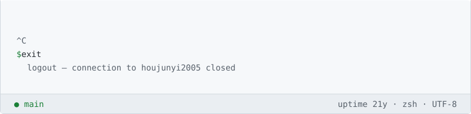

<picture>
  <source media="(prefers-color-scheme: dark)" srcset="assets/terminal-top-dark.svg">
  <source media="(prefers-color-scheme: light)" srcset="assets/terminal-top.svg">
  
</picture>
<picture>
  <source media="(prefers-color-scheme: dark)" srcset="https://raw.githubusercontent.com/89607425/89607425/output/github-contribution-grid-snake-dark.svg">
  <source media="(prefers-color-scheme: light)" srcset="https://raw.githubusercontent.com/89607425/89607425/output/github-contribution-grid-snake.svg">
  
</picture>
<picture>
  <source media="(prefers-color-scheme: dark)" srcset="assets/terminal-bottom-dark.svg">
  <source media="(prefers-color-scheme: light)" srcset="assets/terminal-bottom.svg">
  
</picture>

  

