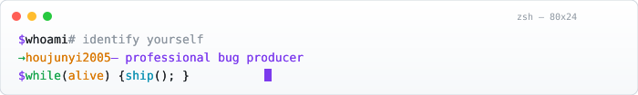

<!-- HEADER -->

  

<!-- TERMINAL -->

   
  
   
   
  <b>Turning coffee into code since 2023.</b> I build AI products, database engines, and occasionally — divination software. 🃏

 

 

<!-- TECH STACK -->

### 🛠 Tech Stack

 

 

<!-- PROJECTS -->

### 🚀 Featured Projects

<table>
  <tr>
    <td width="50%" valign="top">
      <h3 align="center"><a href="https://github.com/89607425/PHDS_RAG">PHDS_RAG</a></h3>
      
Enterprise RAG system for wiki documents — query rewriting, BM25 + ChromaDB hybrid retrieval, BGE-Reranker, and LLM-as-Judge self-check.

      

        
        
        
      

    </td>
    <td width="50%" valign="top">
      <h3 align="center"><a href="https://github.com/89607425/SparrowDB">SparrowDB</a></h3>
      
A lightweight, full-stack SQL database engine written in Java. Three-layer architecture: SQL compiler → database engine → storage system.

      

        
        
        
      

    </td>
  </tr>
  <tr>
    <td width="50%" valign="top">
      <h3 align="center"><a href="https://github.com/89607425/RevYou">RevYou</a></h3>
      
Multi-agent collaboration platform — PM, Dev, and Tester take turns reviewing your PRD to find logical loopholes, technical risks, and test omissions.

      

        
        
        
      

    </td>
    <td width="50%" valign="top">
      <h3 align="center"><a href="https://github.com/89607425/PhotoForYou">PhotoForYou</a></h3>
      
AI photo selection tool — turns 30 minutes of picking from 500 photos into 30 seconds. Built for people who take too many pictures.

      

        
        
        
      

    </td>
  </tr>
  <tr>
    <td width="50%" valign="top">
      <h3 align="center"><a href="https://github.com/89607425/jianlide">jianlide</a></h3>
      
AI resume diagnosis tool — evaluates ATS pass rate, content quality, project experience, and job matching across four dimensions.

      

        
        
        
      

    </td>
    <td width="50%" valign="top">
      <h3 align="center"><a href="https://github.com/89607425/chunfeng">chunfeng</a></h3>
      
When you're not sure, ask the spring breeze — divination software featuring Tarot and Six Yao modules. 🃏

      

        
        
        
      

    </td>
  </tr>
</table>

 

 

<!-- SNAKE -->

### 🐍 Contribution Snake

<picture>
  <source media="(prefers-color-scheme: dark)" srcset="https://raw.githubusercontent.com/89607425/89607425/output/github-contribution-grid-snake-dark.svg" />
  <source media="(prefers-color-scheme: light)" srcset="https://raw.githubusercontent.com/89607425/89607425/output/github-contribution-grid-snake.svg" />
  
</picture>

 

 

<!-- VISITOR -->

  

<!-- FOOTER -->

  

